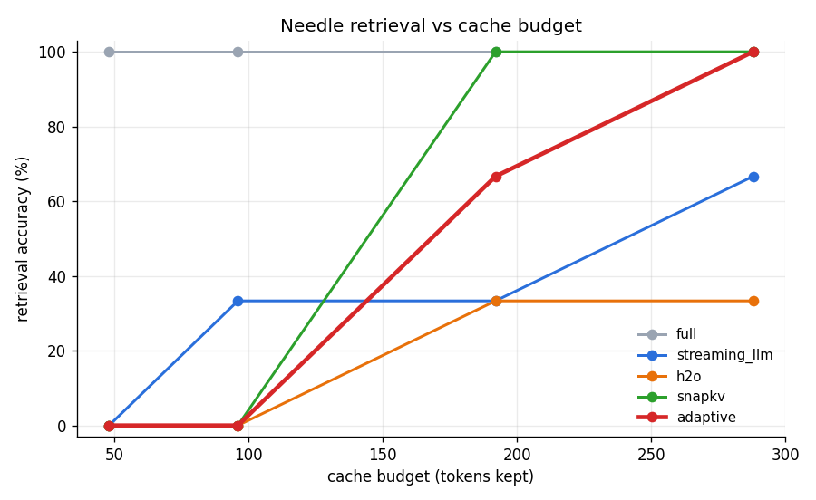

# Adaptive KV Cache Compression

An original KV-cache compression policy for long-context LLM inference, benchmarked honestly against published baselines (StreamingLLM, H2O, SnapKV) on the quality / memory / latency triangle.

**The gap this attacks:** existing methods apply one static heuristic uniformly. StreamingLLM keeps anchors + recent tokens but discards the *entire middle* of the context — so any fact buried mid-context is lost. This project builds a method that spends the same cache budget more cleverly.

**Model:** Qwen2.5-1.5B-Instruct (runs on a free-tier T4).
**Focus:** decode path, no training/finetuning, pure PyTorch.

## The method — "Anchored Skeleton"

Keep three things within a fixed token budget:

- **Anchors** — the first few tokens (the model's attention sink).
- **Recent window** — the most recent tokens (local coherence).
- **Skeleton** — every *k*-th token from the middle, a coarse memory of the whole context.

**What it does that StreamingLLM/H2O/SnapKV do not:** it deliberately retains a thin, evenly-spaced trace of the *middle* of the context instead of dropping it wholesale, so a mid-context fact survives compression.

## Headline result

Needle-in-a-haystack: a code is hidden at depth 0.1 / 0.5 / 0.9 in a long prompt, then requested. Retrieval accuracy (Qwen2.5-1.5B, 3 codes × 3 depths) vs cache budget:

| cache budget | full | streaming_llm | h2o | snapkv | **adaptive (ours)** |
|---:|:---:|:---:|:---:|:---:|:---:|
| 48  | 100% | 0%  | 0%  | 0%   | 0%   |
| 96  | 100% | 33% | 0%  | 0%   | 0%   |
| 192 | 100% | 33% | 33% | 100% | **67%**  |
| 288 | 100% | 67% | 33% | 100% | **100%** |



**Takeaways:**
- **Among query-agnostic methods (streaming_llm, h2o, ours), ours wins** at budgets 192 and 288 — because it retains a chunked trace of the *middle*, where the others drop it.
- **It reaches 100% at budget 288, matching query-aware SnapKV** — despite never reading the question.
- **H2O is weakest on needles**, as expected: heavy-hitter policies evict the needle before it is ever attended to.

_Regenerate from raw data: `python scripts/run_eval.py` → `results/eval_needle.json` + the chart above._

## Status

- ✅ **Phase 0** — manual decode loop, verified token-for-token against `generate()`.
- ✅ **Phase 1** — instrumentation (memory + latency) and the memory/latency-vs-context "before" plot.
- ✅ **Phase 2** — three baselines (StreamingLLM, H2O, SnapKV) + a pluggable eviction interface.
- ✅ **Phase 3** — the Anchored Skeleton method (with a RoPE position fix + chunked skeleton).
- ✅ **Phase 4** — needle-retrieval evaluation across all policies and cache budgets.
- ✅ **Phase 5** — writeup with the headline result above.

## Layout

```
src/akvc/
  model.py            model loading + our manual/policy decode loops
  cache_manager.py    evict() / cache_length() — the cache surgery
  instrumentation.py  peak-memory meter + CUDA-synced timer
  policies/           full, streaming_llm, h2o, snapkv, adaptive (ours)
  eval/               needle task + harness
scripts/              one runnable experiment each (see below)
results/              JSON + plots (regenerate everything from here)
docs/spec.md          full project spec, phase plan, success criteria
```

## Reproducing

Run in a Colab notebook with a GPU (or any CUDA machine). Each script is standalone:

```bash
git clone https://github.com/aarohigandhi/adaptive-kv-cache.git
cd adaptive-kv-cache

python scripts/baseline_sweep.py     # memory/latency vs context length ("before" plot)
python scripts/eviction_demo.py      # StreamingLLM caps the cache ("bent curve" plot)
python scripts/profile_attention.py  # per-head attention-entropy study
python scripts/adaptive_demo.py      # our method vs baselines on one needle
python scripts/run_eval.py           # the full headline evaluation
```

## Honest caveats

- Single small model (Qwen2.5-1.5B); results may not transfer to larger models.
- The needle sweep uses a handful of codes/depths — enough to show the effect, not a full statistical study.
- H2O/SnapKV use a simplified single-budget variant (attention aggregated across heads), not the per-head original.
